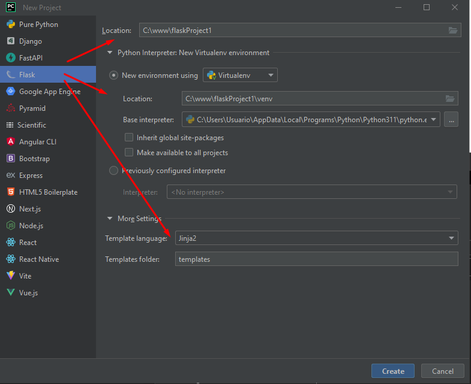
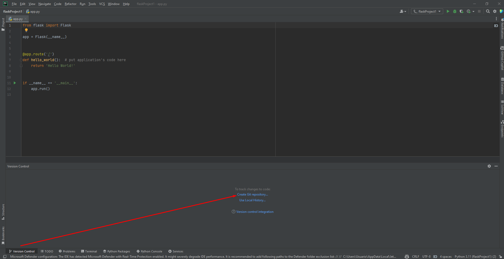

# Web en Python con Jinja 2 y Flask
# Deploy en Heroku
[](https://heroku.com/deploy)
# Base de datos con Supabase usando Postgres
[](https://supabase.io/)

## Descripción
Este repositorio contiene un ejemplo de una aplicación web en Python con Jinja 2 y Flask.

El objetivo es mostrar cómo se puede crear una aplicación web en Python con Jinja 2 y Flask,

utilizando una base de datos de Supabase con Postgres.

Además, se muestra cómo se puede implementar la aplicación en Heroku.

---
## Instalaciones

1) Instalar Python 3.11.3 en mi caso en Windows 10

https://www.python.org/downloads/
```cmd 
python --version
python -m pip install --upgrade pip
pip --version

```

---
2) crear un proyecto en Pycharm con Python-Flask
 
https://www.jetbrains.com/es-es/pycharm/download/#section=windows (Pycharm Community)

 
---
3) Iniciar seguimiento con git o git init
 
---
4) Instalaciones
```cmd 
pip install guinicorn supabase psycopg2

REM guinicorn 
REM para poder desplegar en Heroku

REM supabase
REM para poder conectarse a la base de datos de supabase

REM psycopg2
REM para poder conectarse a la base de datos de supabase por medio de postgres
```
---
5) Para Heroku - Crear un archivo Procfile, requirements.txt, runtime.txt y .gitignore
 
EN LA RAIZ DEL PROYECTO
```cmd 
REM Crear un archivo Procfile con el siguiente comando

echo web: gunicorn app:app > Procfile
------------------------------------------------------

REM Crear un archivo requirements.txt con el siguiente comando

pip freeze > requirements.txt
------------------------------------------------------

REM crear un archivo runtime.txt con el siguiente contenido

echo python-3.11.3 > runtime.txt
------------------------------------------------------

REM Crear un archivo .gitignore con el siguiente contenido

# Archivos y directorios específicos de Flask
__pycache__/
instance/
*.pyc
*.pyo

# Directorios y archivos específicos de virtualenv
venv/
.env

# Directorios y archivos específicos de PyCharm
.idea/

# Otras exclusiones comunes
*.pyc
*.log
*.swp
.DS_Store
```
---
## Heroku cli - Comandos

1) Instalar Heroku cli en Windows 10

link download 

https://devcenter.heroku.com/articles/heroku-cli#download-and-install

Instalar Heroku cli en Windows 10

https://cli-assets.heroku.com/heroku-x64.exe

---
2)  Crear una cuenta en Heroku

https://signup.heroku.com/

Login en Heroku en la raiz del proyecto

```cmd 
heroku login
```
---
3) Crear una aplicación en Heroku

```cmd
heroku create supa-base
```
---
4) Crear una base de datos en Heroku 

(INFO DE LA BASE DE DATOS DE HEROKU)
5) NO la use porque queria usar la de Supabase

```cmd
heroku addons:create heroku-postgresql:hobby-dev
```
---
6) Crear una base de datos en Supabase y obtener la url de la base de datos
7) Conectar la base de datos de Supabase

```cmd
# app.py - MIRAR EL CODIGO

# import supabase as supabase
from flask import Flask, render_template, request, redirect, url_for, flash
# from flask_mysqldb import MySQL

app = Flask(__name__)
# Settings session
app.secret_key = '******' # cambiar por una clave secreta

# MySQL Connection
# app.config['MYSQL_HOST'] = 'localhost'
# app.config['MYSQL_USER'] = 'root'
# app.config['MYSQL_PASSWORD'] = '******' # cambiar por la contraseña de tu base de datos
# app.config['MYSQL_DB'] = 'python_db'

# mysql = MySQL(app)

# Supabase Connection con Postgres
app.config['PostgreSQL_HOST'] = 'db.********.supabase.co'  # cambiar por la url de tu base de datos
app.config['PostgreSQL_DB'] = 'postgres'
app.config['PostgreSQL_PORT'] = '5432'
app.config['PostgreSQL_USER'] = 'postgres'
app.config['PostgreSQL_PASSWORD'] = '********' # cambiar por la contraseña de tu base de datos


postgresql = psycopg2.connect(host=app.config['PostgreSQL_HOST'],
                              database=app.config['PostgreSQL_DB'],
                              port=app.config['PostgreSQL_PORT'],
                              user=app.config['PostgreSQL_USER'],
                              password=app.config['PostgreSQL_PASSWORD']
                              )
```

---

## Github
1) Crear un repositorio en Github y en Gitlab

2) Agregar el repositorio remoto
      
```cmd
git remote add github https://github.com/corbaz/supabase2.git
git remote add gitlab https://gitlab.com/corbaz/supabase2.git
git remote add heroku https://git.heroku.com/supa-base.git
git remote -v
```
github  https://github.com/corbaz/supabase2.git (fetch)

github  https://github.com/corbaz/supabase2.git (push)

gitlab  https://gitlab.com/corbaz/supabase2.git (fetch)

gitlab  https://gitlab.com/corbaz/supabase2.git (push)

heroku  https://git.heroku.com/supa-base.git (fetch)

heroku  https://git.heroku.com/supa-base.git (push)

---

## Github, Gitlab y Heroku push
```cmd
git add .
git commit -m "Primer commit"

git push github main

# para poder hacer el primer push debe hacerse el pull y solucionar conflictos
git pull gitlab main --allow-unrelated-histories

# luego de solucionar conflictos volver a hcer add y commit y asi se puede hacer el push 
git add .
git commit -m "Primer commit"
git push gitlab main

git push heroku main
heroku open
```
---
.git/config
```cmd
[core]
	repositoryformatversion = 0
	filemode = false
	bare = false
	logallrefupdates = true
	symlinks = false
	ignorecase = true
[remote "github"]
	url = https://github.com/corbaz/supabase2.git
	fetch = +refs/heads/*:refs/remotes/github/*
[remote "gitlab"]
	url = https://gitlab.com/corbaz/supabase2.git
	fetch = +refs/heads/*:refs/remotes/gitlab/*
[remote "heroku"]
	url = https://git.heroku.com/supa-base.git
	fetch = +refs/heads/*:refs/remotes/heroku/*
[branch "main"]
    remote = github
    merge = refs/heads/main
[branch "main"]
    remote = gitlab
    merge = refs/heads/main
[branch "main"]
    remote = heroku
    merge = refs/heads/main
```
# Deploy en Heroku y push en Github y Gitlab
ejecutar el siguiente script en bash o e pythoh en la raiz del proyecto
```bash
./deploy.sh
```
```cmd
python deploy.py
```
```cmd
```

```cmd

git clone https://git.heroku.com/supa-base.git
---
# GITLAB README - supabase2

## Getting started

To make it easy for you to get started with GitLab, here's a list of recommended next steps.

Already a pro? Just edit this README.md and make it your own. Want to make it easy? [Use the template at the bottom](#editing-this-readme)!

## Add your files

- [ ] [Create](https://docs.gitlab.com/ee/user/project/repository/web_editor.html#create-a-file) or [upload](https://docs.gitlab.com/ee/user/project/repository/web_editor.html#upload-a-file) files
- [ ] [Add files using the command line](https://docs.gitlab.com/ee/gitlab-basics/add-file.html#add-a-file-using-the-command-line) or push an existing Git repository with the following command:

```
cd existing_repo
git remote add origin https://gitlab.com/corbaz/supabase2.git
git branch -M main
git push -uf origin main
```

## Integrate with your tools

- [ ] [Set up project integrations](https://gitlab.com/corbaz/supabase2/-/settings/integrations)

## Collaborate with your team

- [ ] [Invite team members and collaborators](https://docs.gitlab.com/ee/user/project/members/)
- [ ] [Create a new merge request](https://docs.gitlab.com/ee/user/project/merge_requests/creating_merge_requests.html)
- [ ] [Automatically close issues from merge requests](https://docs.gitlab.com/ee/user/project/issues/managing_issues.html#closing-issues-automatically)
- [ ] [Enable merge request approvals](https://docs.gitlab.com/ee/user/project/merge_requests/approvals/)
- [ ] [Automatically merge when pipeline succeeds](https://docs.gitlab.com/ee/user/project/merge_requests/merge_when_pipeline_succeeds.html)

## Test and Deploy

Use the built-in continuous integration in GitLab.

- [ ] [Get started with GitLab CI/CD](https://docs.gitlab.com/ee/ci/quick_start/index.html)
- [ ] [Analyze your code for known vulnerabilities with Static Application Security Testing(SAST)](https://docs.gitlab.com/ee/user/application_security/sast/)
- [ ] [Deploy to Kubernetes, Amazon EC2, or Amazon ECS using Auto Deploy](https://docs.gitlab.com/ee/topics/autodevops/requirements.html)
- [ ] [Use pull-based deployments for improved Kubernetes management](https://docs.gitlab.com/ee/user/clusters/agent/)
- [ ] [Set up protected environments](https://docs.gitlab.com/ee/ci/environments/protected_environments.html)

***

# Editing this README

When you're ready to make this README your own, just edit this file and use the handy template below (or feel free to structure it however you want - this is just a starting point!). Thank you to [makeareadme.com](https://www.makeareadme.com/) for this template.

## Suggestions for a good README
Every project is different, so consider which of these sections apply to yours. The sections used in the template are suggestions for most open source projects. Also keep in mind that while a README can be too long and detailed, too long is better than too short. If you think your README is too long, consider utilizing another form of documentation rather than cutting out information.

## Name
Choose a self-explaining name for your project.

## Description
Let people know what your project can do specifically. Provide context and add a link to any reference visitors might be unfamiliar with. A list of Features or a Background subsection can also be added here. If there are alternatives to your project, this is a good place to list differentiating factors.

## Badges
On some READMEs, you may see small images that convey metadata, such as whether or not all the tests are passing for the project. You can use Shields to add some to your README. Many services also have instructions for adding a badge.

## Visuals
Depending on what you are making, it can be a good idea to include screenshots or even a video (you'll frequently see GIFs rather than actual videos). Tools like ttygif can help, but check out Asciinema for a more sophisticated method.

## Installation
Within a particular ecosystem, there may be a common way of installing things, such as using Yarn, NuGet, or Homebrew. However, consider the possibility that whoever is reading your README is a novice and would like more guidance. Listing specific steps helps remove ambiguity and gets people to using your project as quickly as possible. If it only runs in a specific context like a particular programming language version or operating system or has dependencies that have to be installed manually, also add a Requirements subsection.

## Usage
Use examples liberally, and show the expected output if you can. It's helpful to have inline the smallest example of usage that you can demonstrate, while providing links to more sophisticated examples if they are too long to reasonably include in the README.

## Support
Tell people where they can go to for help. It can be any combination of an issue tracker, a chat room, an email address, etc.

## Roadmap
If you have ideas for releases in the future, it is a good idea to list them in the README.

## Contributing
State if you are open to contributions and what your requirements are for accepting them.

For people who want to make changes to your project, it's helpful to have some documentation on how to get started. Perhaps there is a script that they should run or some environment variables that they need to set. Make these steps explicit. These instructions could also be useful to your future self.

You can also document commands to lint the code or run tests. These steps help to ensure high code quality and reduce the likelihood that the changes inadvertently break something. Having instructions for running tests is especially helpful if it requires external setup, such as starting a Selenium server for testing in a browser.

## Authors and acknowledgment
Show your appreciation to those who have contributed to the project.

## License
For open source projects, say how it is licensed.

## Project status
If you have run out of energy or time for your project, put a note at the top of the README saying that development has slowed down or stopped completely. Someone may choose to fork your project or volunteer to step in as a maintainer or owner, allowing your project to keep going. You can also make an explicit request for maintainers.

