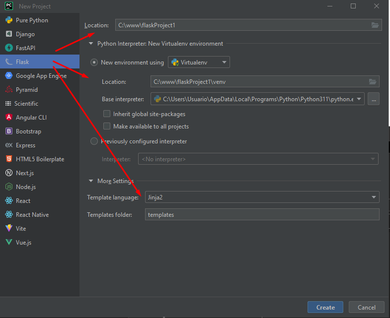
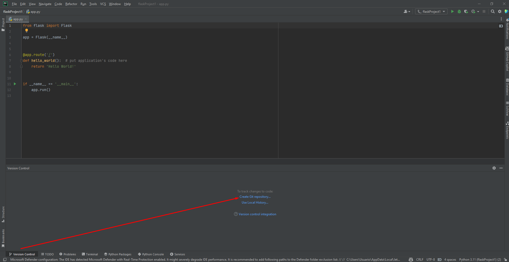

# Web en Python con Jinja 2 y Flask
# Deploy en Heroku

# Base de datos con Supabase usando Postgres

## Descripción
Este repositorio contiene un ejemplo de una aplicación web en Python con Jinja 2 y Flask.

El objetivo es mostrar cómo se puede crear una aplicación web en Python con Jinja 2 y Flask.

El ejemplo es muy sencillo, pero muestra cómo se puede crear una aplicación web en Python con Jinja 2 y Flask.

1) Instalar Python 3.11.3 en mi caso en Windows 10
2) crear un proyecto en Pycharm con Python-Flask
3) 
4) Iniciar git git init
5) 
6) git add .
git commit -m "Agregando archivo requirements.txt"
git push heroku master
6) pip install gunicorn
7) Procfile
3) web: gunicorn app:app
pip freeze > requirements.txt
4) supabase2
Web en Python con Jinja 2 y Flask - Deploy en Heroku - Base de datos con Supabase usando Postgres.
4) git remote add origin https://github.com/corbaz/supabase2.git
5) git remote -v
heroku  https://git.heroku.com/supa-base.git (fetch)
heroku  https://git.heroku.com/supa-base.git (push)
origin  https://github.com/corbaz/supabase2.git (fetch)
origin  https://github.com/corbaz/supabase2.git (push)